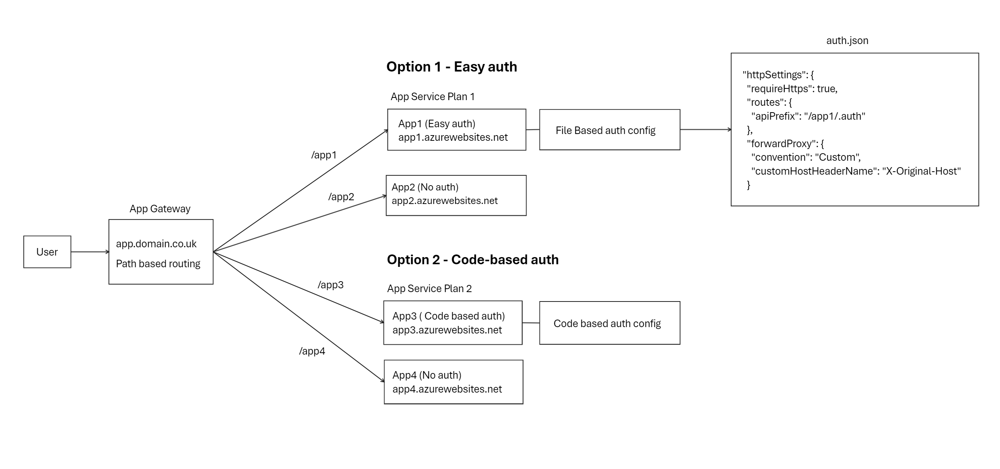

# Understanding Azure App Service Authentication Challenges with Path-Based Routing

Azure Application Gateway (App Gateway) provides the ability to route traffic to multiple backends using path-based routing. However, when integrating authentication, such as Azure App Service authentication (otherwise known as easy auth), complexities arise. This guidance discusses the challenges and considerations when attempting to implement such an approach.

---

## Contents

1. [Understanding the Challenge with Path-Based Routing and Authentication](#understanding-the-challenge-with-path-based-routing-and-authentication)
2. [Subdomains vs Path Based Routing](#Subdomains-vs-Path-Based-Routing)
3. [App Service Authentication Options with Path-Based Routing ](#app-service-authenticaton-options-with-path-based-routing)
   - [Option 1: Easy Auth with Host Header Override](#option-1-easy-auth-with-host-header-override)
   - [Option 2: Code-Based Authentication with Host Header Override](#option-2-code-based-authentication-with-host-header-override)
   - [Options Summary](#options-summary)
5. [General Tips](#general-tips)

---

## Understanding the Challenge with Path-Based Routing and Authentication

Path-based routing directs traffic based on URL paths, which can create conflicts with authentication workflows that expect specific hostnames or domains.

Challenges include:
- **Callback URLs** must match the configuration in the Azure App Registration and authentication settings.
- **Host Headers** might be overridden or mismatched due to App Gateway settings, leading to unexpected redirects.
- **Path-based routing rules** require careful configuration to avoid conflicts, particularly with wildcard entries or overlapping path patterns.

---

## Subdomains vs Path Based Routing

Subdomain-based routing is often preferable when each app has distinct requirements or independent functionality. It is also considered the path of least resistance when using easy auth.

With subdomains, each application behind the App Gateway can maintain unique authentication configurations without conflicting callback paths. For instance, `https://app1.example.com` and `https://app2.example.com` can independently handle easy auth or other forms of authentication without risking path-based conflicts.

### Benefits of Subdomain Routing:
- **Simplified Configuration**: Each app can have independent callback URLs, reducing overlap and the need for custom configuration.
- **Reduced Risks**: Avoids issues with overlapping paths, host header overrides, and wildcard routing conflicts.
- **More Reliable Auth Flows**: Supports a more stable integration with Easy Auth or other identity providers.

Path-based routing, however, is often used when the apps or services are related and need to share a common base URL. Examples include, sites with shared authentication or endpoints that are part of the same application. In these cases, path-based routing may be preferable, but it requires careful configuration to ensure authentication flows work as expected. 


>[!IMPORTANT]
> This write-up focuses on more nuanced use cases, such as scenarios where you might be trying to achieve multiple authentication flows or a mix of anonymous and authentication-enabled apps behind a single domain name. Hopefully, it will become clear that switching to subdomain routing is the simpler and more reliable option to consider first.

---

## App Service Authenticaton options with Path-Based Routing



The diagram above shows a scenario where apps sharing an App Service plan may require different approaches to authentication, i.e., one with authentication and one without (anonymous).  

Authentication can be handled using two options: easy auth and code-based authentication. In both options, the default App Service hostname is used to avoid domain conflicts. This is because you cannot configure the same custom domain for multiple App Services. See [Azure’s documentation](https://learn.microsoft.com/en-us/azure/app-service/manage-custom-dns-migrate-domain#how-do-i-migrate-a-domain-from-another-app:~:text=A%20domain%20name%20can%20be%20assigned%20to%20only%20one%20app%20in%20each%20deployment%20unit.) for more information.

>[!WARNING]
> Not using a custom domain on the App Service backend goes against general best practice. Verify the impact of using the default hostname by consulting [Azure’s host name preservation guide](https://learn.microsoft.com/en-us/azure/architecture/best-practices/host-name-preservation).

---

### Option 1: Easy Auth with Host Header Override

Using Azure App Service’s Easy Auth with path-based routing requires configuring the host headers and authentication settings to ensure that requests respect the path and route configurations.

Note: The guidance below assume you have an existing Azure App Service with [easy auth](https://learn.microsoft.com/en-us/azure/app-service/overview-authentication-authorization) enabled and an Azure Application Gateway set up with [path-based routing](https://learn.microsoft.com/en-us/azure/application-gateway/create-url-route-portal) rules.

#### Considerations:
1. **App Gateway Configuration**: Set up the backend HTTP setting in App Gateway to pick the hostname from the backend target. This uses the default App Service hostname to avoid domain conflicts. 

2. **App Registration Callback URL**: Ensure the app registration includes the correct callback URL, including the path (e.g., `https://yourdomain.com/yourpath/.auth/login/aad/callback`).

3. **Easy Auth Configuration (auth.json)**:
    - When using App Service Easy Auth behind Application Gateway, authentication redirects default to the app's Azure domain, often causing errors. To fix this, configure Easy Auth to read the X-Original-Host header from Application Gateway using file-based configuration as described in [Azure’s documentation](https://learn.microsoft.com/en-us/azure/app-service/configure-authentication-file-based#enabling-file-based-configuration).  

    - Update your `auth.json` to define the required HTTP settings:
        ```json
        "httpSettings": {
        "requireHttps": true,
        "routes": {
            "apiPrefix": "/YOUR_APP_PATH/.auth"
        },
        "forwardProxy": {
            "convention": "Custom",
            "customHostHeaderName": "X-Original-Host"
        }
        }
        ```
    - If issues persist, refer to the [configuration file reference](https://learn.microsoft.com/en-us/azure/app-service/configure-authentication-file-based#configuration-file-reference) and ensure you have the correct configuration for your scenario. For example, adding a value for  `"allowedExternalRedirectUrls"` to include `https://YOURDOMAIN.com/YOURPATH`.
    - Finally, make sure your app is configured to accept requests at the specified path. For Windows App Services, this can be done by mapping a [virtual directory](https://learn.microsoft.com/en-us/azure/app-service/configure-common?tabs=portal#map-a-url-path-to-a-directory) to the path. For Linux, this can be done by updating the app routes in your code.

>[!NOTE]
> One aspect that is not well-documented is the impact of the apiPrefix setting within file-based configuration. Without setting this value, Easy Auth will redirect to the root domain, disregarding your path-based routing configuration. To ensure correct routing, modify the apiPrefix value to match your app's path, as shown in the auth.json example above.

---

### Option 2: Code-Based Authentication with Host Header Override

For scenarios requiring more flexibility, implementing custom authentication within the app code can be beneficial. This allows for handling authentication requests programmatically, which can help with maintaining control over redirect paths and headers. With this approach the user can also be presented with a custom login page before accessing the app.

Note: The guidance below assume you have an existing Azure App Service and an Azure Application Gateway set up with [path-based routing](https://learn.microsoft.com/en-us/azure/application-gateway/create-url-route-portal) rules.

#### Considerations:
1. **Set up Authentication in Code**: Configure your app to authenticate users using a code-based approach with Microsoft Entra ID. Refer to the [Quickstart for Python Flask web app](https://learn.microsoft.com/en-us/entra/identity-platform/quickstart-web-app-python-flask?tabs=windows) to set up authentication with a sample app.

2. **App Registration Adjustments**: Ensure the redirect URI in the app registraion matches that of your app hostname and path. For the quickstart this will be 'https://YOURDOMAIN.COM/YOURPATH/getAToken'

3. **Path-Based Routing Adjustments**:
   - Update the app routes in app.py to ensure your app responds to the path set in App Gateway. Each route must be configured to accept requests at the specified path (e.g., `@app.route("/YOURPATH")`).
   - Define the `REDIRECT_PATH` in `app_config.py` with the format `/YOURPATH/getAToken`.

4. **Deployment**: Deploy the app to your Azure App Service using your CI/CD process or the [Azure Tools](https://code.visualstudio.com/docs/python/python-on-azure) extension in VSCode. 

---

### Options Summary
App Service authentication with path-based routing options.

| Approach                          | Pros                                 | Cons                                  |
|-----------------------------------|--------------------------------------|---------------------------------------|
| **Easy Auth**  | Minimal app code changes | Complex App Service configuration, limited flexibility |
| **Code-Based Auth**     | Full control, flexible, login page customisation               | Dependency on developer skills and code level changes |

---

## General Tips

1. **Host Headers and Redirect URLs**: Ensure that host headers match expected values to prevent redirect mismatches.
2. **Callback URL Consistency**: Confirm that callback URLs are consistently configured in both App Service and Entra ID to match the path-based routing setup.
3. **Avoid Overlapping Paths**: Be cautious with wildcard entries in routing (e.g., `/app*`), which may unintentionally capture routes for other applications.
4. **Health Probes**: When using App Gateway, configure health probes to target the correct path (e.g., `/YOUR_APP_PATH/`) and verify that App Service responds correctly.

---

>[!IMPORTANT]
> To conclude and repeat my initial warning - This write-up focuses on more nuanced use cases, such as scenarios where you might be trying to achieve multiple authentication flows or a mix of anonymous and authentication-enabled apps behind a single domain name. Hopefully, it is clear that using subdomain routing is the simpler and more reliable option to consider first.
